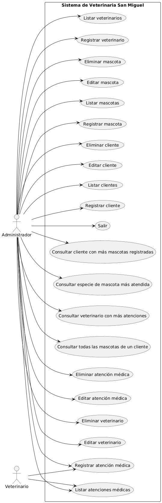
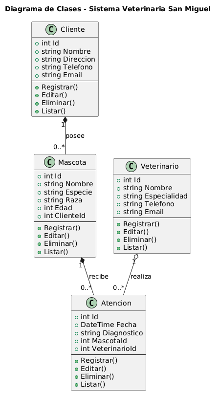
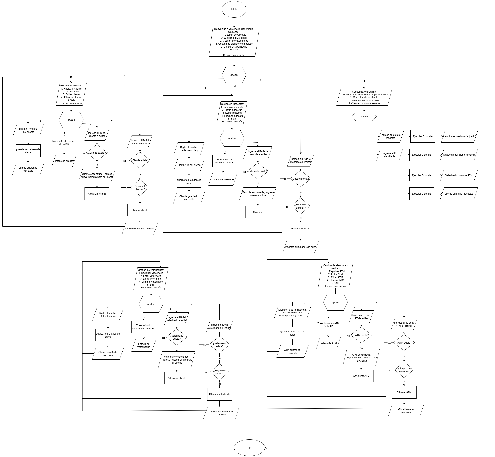

# 🐾 Sistema Veterinaria San Miguel

Este proyecto es un sistema de consola en **C#** que gestiona clientes, mascotas, veterinarios y atenciones médicas.  
Está construido aplicando **Programación Orientada a Objetos (POO)** y utilizando **Entity Framework Core con MySQL** para la persistencia de datos.  

El objetivo es simular el proceso completo de registro, consulta y atención médica de las mascotas, aplicando menús interactivos en consola, integrando una base de datos y reforzando los conceptos vistos en clase.

---

## 📂 Estructura de Carpetas

```bash
.
├── Controllers     # Manejan la lógica principal de cada entidad (intermediarios entre Services y la consola)
├── Data            # Contiene la configuración de la base de datos y DbContext (EF Core)
├── Migrations      # Archivos generados por EF Core para crear/actualizar la base de datos
├── Models          # Clases que representan las entidades del sistema (Cliente, Mascota, Veterinario, Atención)
├── Services        # Contienen la lógica de negocio puntual que usan los Controllers
├── SubMenus        # Implementación de los menús de navegación por cada gestión de entidad
├── Program.cs      # Punto de entrada del programa (menú principal)
├── Sprint2.csproj  # Configuración del proyecto C#
└── README.md       # Documentación del sistema
```

---

## 🛠️ Funcionamiento por capas

- **Models**  
  Contienen las entidades con sus atributos y relaciones.  
  Ejemplo: `Pet`, `Client`, `Veterinarian`, `MedicalCare`.

- **Data**  
  Incluye la clase `VeterinariaDbContext` donde se configuran las tablas y relaciones entre entidades.  
  Aquí también se establece la conexión con la base de datos MySQL.

- **Services**  
  Lógica de negocio que trabaja directamente con el DbContext.  
  Ejemplo: `PetServices` permite listar, buscar y registrar mascotas en la base de datos.

- **Controllers**  
  Se encargan de recibir la entrada desde la consola y coordinar el flujo con los Services.  
  Ejemplo: `PetController` gestiona la creación de mascotas solicitando datos al usuario y validándolos.

- **SubMenus**  
  Cada submenú representa la gestión de una entidad (Clientes, Mascotas, Veterinarios, Atenciones).  
  Desde aquí se llaman los controladores correspondientes.

- **Program.cs**  
  Contiene el **menú principal** que conecta todos los submenús y mantiene la ejecución del sistema mediante ciclos.

---

## 🚀 Flujo de Ejecución

1. El programa inicia mostrando el **menú principal** desde `Program.cs`.  
2. El usuario selecciona una opción (Clientes, Mascotas, Veterinarios, Atenciones, Consultas o Salir).  
3. Dependiendo de la elección, se ejecuta el **SubMenu** correspondiente.  
4. El **Controller** de la entidad recibe los datos desde la consola y valida la entrada.  
5. El Controller utiliza un **Service** para realizar operaciones en la base de datos.  
6. El Service interactúa con el **DbContext (Data)** para crear, consultar, actualizar o eliminar registros.  
7. Se muestra el resultado al usuario y el programa vuelve al menú.  

---

## 📊 Tecnologías Utilizadas

- **Lenguaje**: C# (.NET 8 Console App)  
- **ORM**: Entity Framework Core  
- **Base de Datos**: MySQL  
- **Paradigma**: Programación Orientada a Objetos (POO)  

---

## 📖 Funcionalidades

- **Gestión de Clientes (CRUD)**  
  - Registrar cliente  
  - Listar clientes  
  - Editar cliente  
  - Eliminar cliente  

- **Gestión de Mascotas (CRUD)**  
  - Registrar mascota  
  - Listar mascotas  
  - Editar mascota  
  - Eliminar mascota  

- **Gestión de Veterinarios (CRUD)**  
  - Registrar veterinario  
  - Listar veterinarios  
  - Editar veterinario  
  - Eliminar veterinario  

- **Gestión de Atenciones Médicas (CRUD)**  
  - Registrar atención médica (fecha, diagnóstico, mascota y veterinario)  
  - Listar atenciones médicas  
  - Editar atención médica  
  - Eliminar atención médica  

- **Consultas Avanzadas (LINQ sobre EF Core)**  
  - Consultar historial medico de una mascota.
  - Consultar todas las mascotas de un cliente.  
  - Consultar el veterinario con más atenciones realizadas.  
  - Consultar la especie de mascota más atendida en la clínica.  
  - Consultar el cliente con más mascotas registradas.  

  ---

## 📊 Diagramas UML

### Diagrama de Clases


### Diagrama de Entidad-Relación (ER)


### Diagrama de Casos de Uso


---
